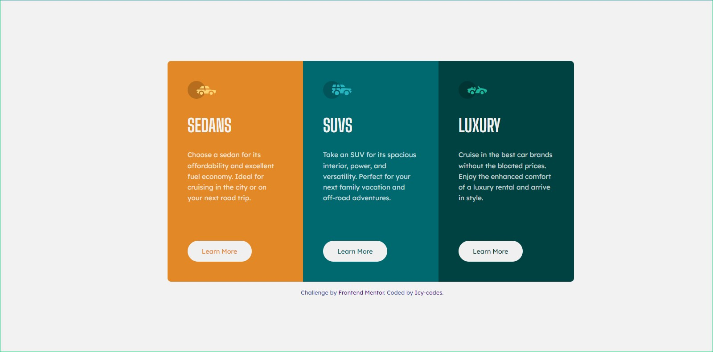

# Frontend Mentor - 3-column preview card component solution

This is a solution to the [3-column preview card component challenge on Frontend Mentor](https://www.frontendmentor.io/challenges/3column-preview-card-component-pH92eAR2-). Frontend Mentor challenges help you improve your coding skills by building realistic projects. 

## Table of contents

- [Overview](#overview)
  - [The challenge](#the-challenge)
  - [Screenshot](#screenshot)
  - [Links](#links)
  - [Built with](#built-with)
  - [What I learned](#what-i-learned)
  - [Continued development](#continued-development)
- [Author](#author)
- [Acknowledgments](#acknowledgments)

## Overview
The challenge generally was not as difficult as the previous ones, but I still had issues centering the attribution class. Concerning HTML, a warning on my inspected browser kept on reminding me about the "content-type: text/html" and I have no idea on what to do about that
### The challenge

Users should be able to:

- View the optimal layout depending on their device's screen size
- See hover states for interactive elements

### Screenshot




### Links

- Solution URL: [Github](https://github.com/Canice10/3-column-preview-card-component)
- Live Site URL: [Netlify](https://icycodes-3-column-preview-card.netlify.app/)

### Built with

- Semantic HTML5 markup
- CSS custom properties
- Flexbox
- [Styled Components](https://styled-components.com/) - For styles


### What I learned

Okay, learnt the use of the transition and transform property in css;

```css
.one, .two, .three, img {
    transition: transform .3s ease-in-out;
}

.one, .two, .three, img:hover {
    transform: translate3d(2em, 0, 2em);
}
```

### Continued development

I'm still working on my centering and I will love to use the transform and transition property more in future projects. Media query is not as hard as it used to be😎🤗 

## Author

- Frontend Mentor - [@Canice10](https://www.frontendmentor.io/profile/Canice10)
- Twitter - [@Canice_tweets](https://www.twitter.com/canice_tweets)


## Acknowledgments

I really appreciate the help I'm getting from the Frontend Mentor community especially from:
- [Vanza Setia] (https://www.frontendmentor.io/profile/vanzasetia).

